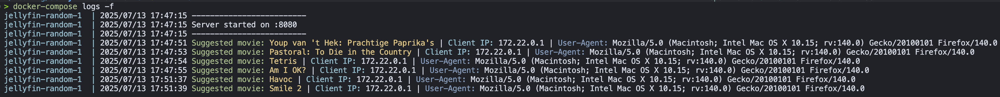
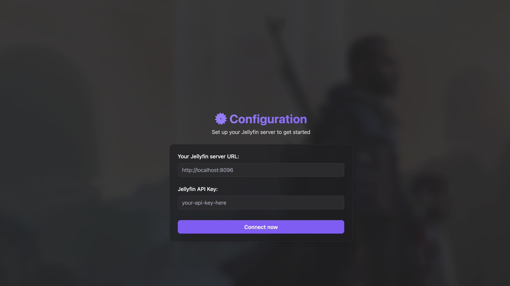
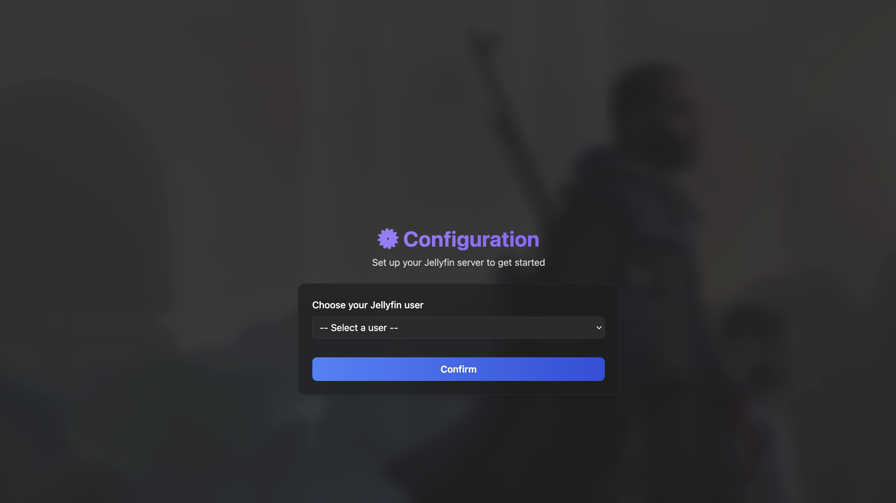

# Jellyfin-RandomMovie

Simple web app for find a random movie from your Jellyfin Server.


## Installation
```bash
docker-compose up -d --build
````

## Debug
```bash
docker-compose logs -f
````


## Stop
```bash
docker-compose down
```

## More media


